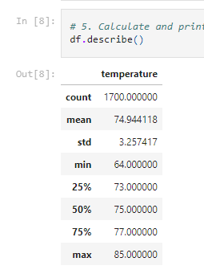
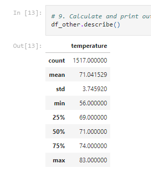

# Surfs up! Hawaii Weather Data

## Overview
The purpose of this anaylsis is two fold. Firstly it is to present to an investor, W. Avi, on the temperature for the island Oahu. This is so that we can accuractly predict if the rain will impeed the buisness from growing. Secondly it will also allow us in running the buisness to predict possible slow or busy days, as well as plan out best days to be open or to be closed.

## Results 
From the results we see that the average temperature throughout the year changes little, with the average temperature in June being little higher than December. Other than that what this shows us is that the island of Oahu is very consistant. 

 

## Disscussion and Summary
While an initial look at the data shows a promisisng results, with a low standard diviation in both snapshots, the main issue that would require further investigating is the issue of tropical storms and extreme weather, as well as the issue of rising sea levels and flood that may cause the buisness to be inoperable long term. These issues should be addressed before moving forward as well as overall lower travel due to covid, which will alter the timeline for when the store is to open.
